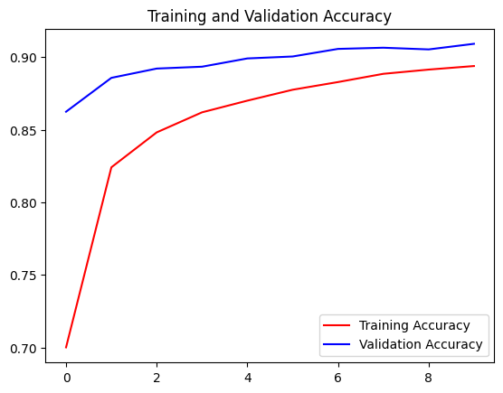
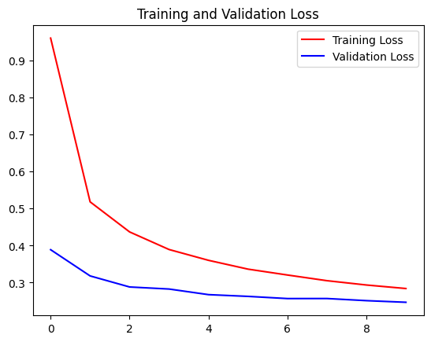
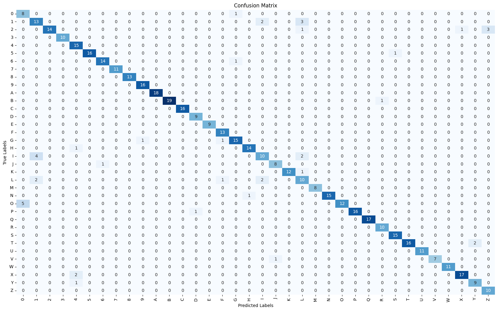

# Handwritten Character Recognition

### **Description**


This project focuses on training and utilizing a neural network to classify squared black&white image (VIN character boxes) with single handwritten character on it. The project includes a training script to prepare, train, and save the model, as well as a test inference script that takes a directory path as a command-line argument and outputs the results in CSV format.

### **About Dataset**
The **EMNIST** ((https://www.kaggle.com/datasets/crawford/emnist)) Balanced dataset was used to solve the handwritten character recognition problem. It contains images of digits (0-9) and uppercase letters (A-Z). The data was sourced from two files:


*   **emnist-balanced-train.csv:** This file contains training data with images of digits (0-9) and uppercase letters (A-Z). Images of lowercase letters were excluded, as they are not necessary for this specific task.
*   **emnist-balanced-test.txt:** This file was used for testing the model. It contains 500 images of digits (0-9) and uppercase letters (A-Z).


**Data Format**

The dataset is provided in CSV format, where each row corresponds to a single image. The structure of the CSV file is as follows:

785 columns per row:


*   The first column contains the class label, which corresponds to the character being represented (e.g., 0 for digit '0', 1 for digit '1', etc.).
*   The remaining 784 columns represent pixel values for a 28x28 grayscale image, with each column corresponding to one pixel's intensity (ranging from 0 to 255).


**Label Mapping**

The **emnist-balanced-mapping.txt** file provides the mapping between class labels and their respective ASCII codes. This file contains two columns:


*   The first column is the label number, corresponding to a specific class.
*   The second column contains the ASCII code of the character represented by the label.

### **Project Structure**
```
handwrite/
│
├── data/                      # Data directory
│   ├── emnist-balanced-mapping.txt
│   ├── emnist-balanced-test.csv
│   └── emnist-balanced-train.csv
│
├── model/                     # Model directory
│   └── cnn_model.h5          # Trained CNN model
│
├── notebooks/                     # Model directory
│   └── EDA_VIN_Handwritten_Character_Recognition.ipynb         
│
├── handwrite/            # Main package directory
│   ├── __init__.py
│   ├── data_processing.py    # Data preprocessing utilities
│   ├── inference_script.py   # Model inference implementation
│   ├── model.py             # Model architecture definition
│   └── train.py             # Model training script
│
├── pyproject.toml            # Project configuration and dependencies
└── requirements.txt          # Project dependencies
```

**Components Description**
**Data Files**

*   **EDA_VIN_Handwritten_Character_Recognition.ipynb**: Jupyter notebook containing exploratory data analysis
*   **emnist-balanced-mapping.txt**: Character mapping definitions for the EMNIST dataset
*   **emnist-balanced-test/train.csv**: EMNIST dataset files for model training and testing

**Scripts**

*   **data_processing.py**: Functions for data preprocessing and augmentation
*   **inference_script.py**: Implementation of model inference for character recognition
*   **model.py**: Definition of the CNN model architecture
*   **train.py**: Script for training the model on the EMNIST dataset

**Configuration Files**

*   **pyproject.toml**: Project configuration and build settings
*   **requirements.txt**: List of Python package dependencies

### **Setup and Installation**
1. Extract the project archive:

```bash
unzip vin_handwrite.zip
cd vin_handwrite
```
2. Create and activate a virtual environment:
```bash
# On Windows:
python -m venv venv
venv\Scripts\activate
```
3. Install dependencies:
```bash
pip install -r requirements.txt
```
4. Run the inference script. Navigate to the directory where the "inference_script.py" file Replace <directory_path> in the command with the actual path to the directory containing your image samples. Make sure to provide the full path or relative path depending on your file system. 

```bash
cd vin_handwrite
python inference_script.py <directory_path>
```

### **Example of running inference_script.py**

Run the test inference script:

```bash
(venv) C:\Users\kharc\Desktop\vin_handwrite\vin_handwrite>python inference_script.py C:\Users\kharc\Desktop\vin_handwrite\data\test
```
Output :

```bash
076, C:\Users\kharc\Desktop\vin_handwrite\data\test\letter_C.jpg
084, C:\Users\kharc\Desktop\vin_handwrite\data\test\letter_T.jpg
073, C:\Users\kharc\Desktop\vin_handwrite\data\test\number_1.png
050, C:\Users\kharc\Desktop\vin_handwrite\data\test\number_2.png
070, C:\Users\kharc\Desktop\vin_handwrite\data\test\number_5.png
```

### **Example of running train.py**
The handwritten_recog.py prepares, trains, and saves the neural network model. It is responsible for designing the architecture and training the model using the dataset.


To run the training script, use the following command:

```bash
python train.py
```


Ensure that the training dataset is properly configured and accessible within the script. You may need to adjust the script parameters, such as the number of epochs or batch size, to suit your specific requirements.

## Data Processing Pipeline

### 1. Dataset Loading and Preprocessing
- **Dataset Import**
  - Loading EMNIST balanced dataset
  - Initial data inspection and validation
  - Data normalization and formatting

### 2. Data Analysis and Understanding
- **Dataset Characteristics Analysis**
  - Image dimensions and properties
  - Class distribution assessment
  - Label encoding scheme verification
  - Statistical analysis of dataset structure

### 3. Data Visualization
- **Visualization Components**
  - Sample image generation and visualization
  - Class distribution analysis
  - Image quality and variation inspection

### 4. Mean Image Analysis
- **Class-Specific Processing**
  - Generation of mean images for each class
  - Character-specific heatmap creation
  - Pattern analysis for individual characters

### 5. Distance-Based Analysis
- **Euclidean Distance Calculations**
  - Distance between individual images and class means
  - Inter-class mean difference analysis
  - Within-class variation statistics

### 6. Outlier Detection and Processing
- **IQR-Based Detection**
  - Implementation of outlier detection algorithm
  - Threshold calculations:
    ```
    Upper bound = Q3 + 1.5 * IQR
    Lower bound = Q1 - 1.5 * IQR
    ```
  - Outlier removal for dataset optimization

### 7. Model Development and Training
- **CNN Architecture Implementation**
  ```python
  
    model = tf.keras.models.Sequential([
        tf.keras.layers.Conv2D(32, (3, 3), activation='relu', input_shape=(28, 28, 1)),
        tf.keras.layers.MaxPooling2D(2, 2),
        tf.keras.layers.Conv2D(32, (3, 3), activation='relu'),
        tf.keras.layers.MaxPooling2D(2, 2),
        tf.keras.layers.Flatten(),
        tf.keras.layers.Dense(128, activation='relu'),
        tf.keras.layers.Dropout(0.5),
        tf.keras.layers.Dense(num_classes, activation='softmax')
    ])
  ```
- **Training Configuration**
  - Batch size: 32
  - Number of epochs: 10
  - Optimizer: Adam
  - Learning rate: 0.001

### 8. Model Evaluation

Training Results
<p align="center">
  
  <br>
  <em>Figure 1: Model Training Accuracy Over Epochs</em>
</p>
<p align="center">
  
  <br>
  <em>Figure 2: Model Training Loss Over Epochs</em>
</p>
Confusion Matrix Analysis
<p align="center">
  
  <br>
  <em>Figure 3: Confusion Matrix for Model Evaluation Results</em>
</p>


